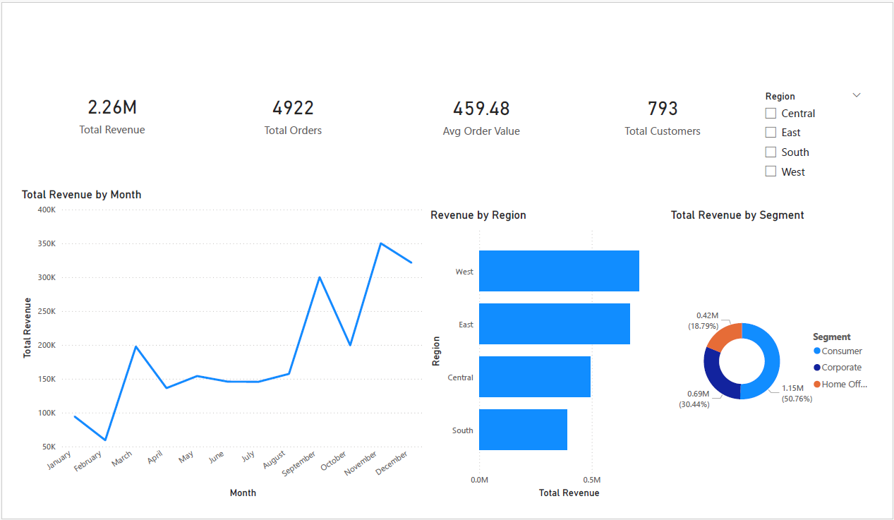
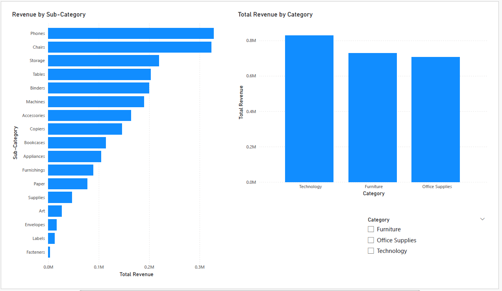

# Financial Performance Dashboard — Sales Analysis

Power BI dashboard analysing 9,800 sales orders (2015–2018) across regions, segments, and product categories, turning raw sales data into executive-ready revenue insights.

## Project Overview

This project analyses a retail sales dataset (Superstore) covering order dates, customer segments, regions, and product categories. The goal is to give decision-makers a clear view of revenue trends, top-performing regions and categories, and seasonal patterns.

## Objectives

- Track total revenue, order volume, and average order value at a glance
- Analyse monthly and yearly revenue trends
- Compare performance across regions, segments, and product categories
- Identify top revenue-driving products and sub-categories

## System Architecture

- **Data Collection Layer** — retail sales dataset (9,800 orders, 2015–2018)
- **Data Processing Layer** — Power Query date parsing and type validation
- **Analysis Layer** — DAX measures for revenue KPIs and time intelligence
- **Visualisation Layer** — Power BI dashboard (2 pages)

## Key Features

- KPI cards: total revenue, total orders, average order value, top region
- Monthly revenue trend line chart with year-over-year view
- Revenue by region and segment breakdowns
- Category and sub-category revenue ranking
- Interactive slicers for year, region, and segment

## Technologies Used

- Microsoft Power BI (Power Query, DAX)

## Data Pipeline Workflow

1. Data import (retail sales dataset)
2. Date parsing and data type validation in Power Query
3. DAX measure creation (revenue KPIs, time aggregations)
4. Dashboard visualisation across 2 pages

## Use Cases

- Sales performance monitoring
- Regional and segment revenue comparison
- Product category analysis
- Business performance reporting

## Data Limitations

This dataset contains sales revenue only — it does not include cost, profit margin, or budget figures, so budget-vs-actual and profitability analysis are out of scope. A future version could incorporate cost data for full financial variance analysis.

## Screenshots

## Key Learnings

- Time intelligence in Power BI (monthly/yearly trend aggregation from transaction dates)
- DAX measure design for sales KPIs (DISTINCTCOUNT, AVERAGEX patterns)
- Multi-level category analysis and ranking visuals

## Future Improvements

- Add cost and profit data for true financial variance analysis
- Add customer-level analysis (repeat purchase, top customers)
- Add forecasting for revenue projection

## Author

Anne Subashini Sritharan

## Project Note

This project demonstrates how Power BI can turn transactional sales data into clear revenue insights that support business decision-making.
